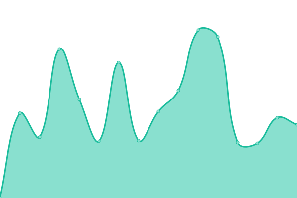
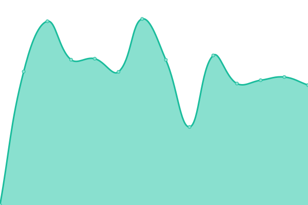

# [📈 Live Status](https://status.mv-angelbachtal.de): <!--live status--> **🟩 Alle Systeme sind betriebsbereit**

This repository contains the open-source uptime monitor and status page for [Musikverein Angelbachtal e.V.](https://www.mv-angelbachtal.de), powered by [Upptime](https://github.com/upptime/upptime).

With [Upptime](https://upptime.js.org), you can get your own unlimited and free uptime monitor and status page, powered entirely by a GitHub repository. We use [Issues](https://github.com/mvangelbachtal/upptime/issues) as incident reports, [Actions](https://github.com/mvangelbachtal/upptime/actions) as uptime monitors, and [Pages](https://status.mv-angelbachtal.de) for the status page.

<!--start: status pages-->
<!-- This summary is generated by Upptime (https://github.com/upptime/upptime) -->
<!-- Do not edit this manually, your changes will be overwritten -->
<!-- prettier-ignore -->
| URL | Status | Verlauf | Antwortzeit | Verfügbarkeit |
| --- | ------ | ------- | ------------- | ------ |
|  [MV Angelbachtal](https://www.mv-angelbachtal.de) | 🟩 Betriebsbereit | [mv-angelbachtal.yml](https://github.com/mvangelbachtal/upptime/commits/HEAD/history/mv-angelbachtal.yml) | 

 1477ms
     
 | 

<a href="https://status.mv-angelbachtal.de/history/mv-angelbachtal">99.44%</a>
    

|  [Staging MV Angelbachtal](https://staging.mv-angelbachtal.de) | 🟩 Betriebsbereit | [staging-mv-angelbachtal.yml](https://github.com/mvangelbachtal/upptime/commits/HEAD/history/staging-mv-angelbachtal.yml) | 

 2139ms
     
 | 

<a href="https://status.mv-angelbachtal.de/history/staging-mv-angelbachtal">99.45%</a>
    

|  [Nextcloud](https://cloud.mv-angelbachtal.de) | 🟩 Betriebsbereit | [nextcloud.yml](https://github.com/mvangelbachtal/upptime/commits/HEAD/history/nextcloud.yml) | 

 990ms
     
 | 

<a href="https://status.mv-angelbachtal.de/history/nextcloud">100.00%</a>
    

|  [SSO](https://accounts.mv-angelbachtal.de) | 🟩 Betriebsbereit | [sso.yml](https://github.com/mvangelbachtal/upptime/commits/HEAD/history/sso.yml) | 

 675ms
     
 | 

<a href="https://status.mv-angelbachtal.de/history/sso">100.00%</a>
    

|  [Jitsi](https://meet.mv-angelbachtal.de) | 🟩 Betriebsbereit | [jitsi.yml](https://github.com/mvangelbachtal/upptime/commits/HEAD/history/jitsi.yml) | 

 532ms
     
 | 

<a href="https://status.mv-angelbachtal.de/history/jitsi">100.00%</a>
    

|  [Etherpad](https://meet.mv-angelbachtal.de/etherpad) | 🟩 Betriebsbereit | [etherpad.yml](https://github.com/mvangelbachtal/upptime/commits/HEAD/history/etherpad.yml) | 

 237ms
     
 | 

<a href="https://status.mv-angelbachtal.de/history/etherpad">100.00%</a>
    

|  [Monitoring](http://grafana.mv-angelbachtal.de) | 🟩 Betriebsbereit | [monitoring.yml](https://github.com/mvangelbachtal/upptime/commits/HEAD/history/monitoring.yml) | 

 877ms
     
 | 

<a href="https://status.mv-angelbachtal.de/history/monitoring">100.00%</a>
    

|  [Onlyoffice](onlyoffice.mv-angelbachtal.de) | 🟩 Betriebsbereit | [onlyoffice.yml](https://github.com/mvangelbachtal/upptime/commits/HEAD/history/onlyoffice.yml) | 

 777ms
     
 | 

<a href="https://status.mv-angelbachtal.de/history/onlyoffice">100.00%</a>
    

|  [Collabora](collabora.mv-angelbachtal.de) | 🟩 Betriebsbereit | [collabora.yml](https://github.com/mvangelbachtal/upptime/commits/HEAD/history/collabora.yml) | 

 648ms
     
 | 

<a href="https://status.mv-angelbachtal.de/history/collabora">100.00%</a>
    

|  [Sympa](https://lists.mv-angelbachtal.de) | 🟩 Betriebsbereit | [sympa.yml](https://github.com/mvangelbachtal/upptime/commits/HEAD/history/sympa.yml) | 

 689ms
     
 | 

<a href="https://status.mv-angelbachtal.de/history/sympa">100.00%</a>
    

|  [Postfix](lists.mv-angelbachtal.de) | 🟩 Betriebsbereit | [postfix.yml](https://github.com/mvangelbachtal/upptime/commits/HEAD/history/postfix.yml) | 

 111ms
     
 | 

<a href="https://status.mv-angelbachtal.de/history/postfix">100.00%</a>
    

|  [E-Mail](mail.mv-angelbachtal.de) | 🟩 Betriebsbereit | [e-mail.yml](https://github.com/mvangelbachtal/upptime/commits/HEAD/history/e-mail.yml) | 

 112ms
     
 | 

<a href="https://status.mv-angelbachtal.de/history/e-mail">100.00%</a>
    

<!--end: status pages-->

[**Visit our status website →**](https://status.mv-angelbachtal.de)

## 📄 License

- Powered by: [Upptime](https://github.com/upptime/upptime)
- Code: [MIT](./LICENSE) © [Anand Chowdhary](https://anandchowdhary.com), supported by [Pabio](https://pabio.com)
- Data in the `./history` directory: [Open Database License](https://opendatacommons.org/licenses/odbl/1-0/)
